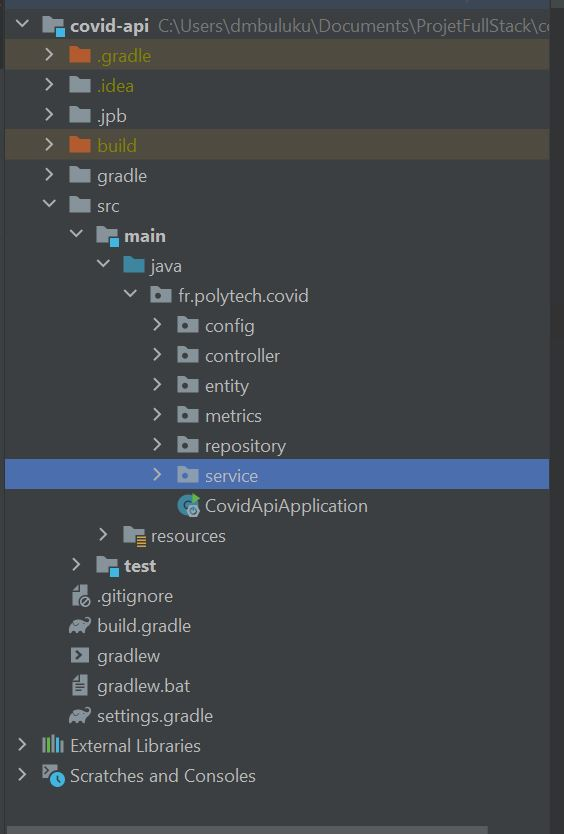
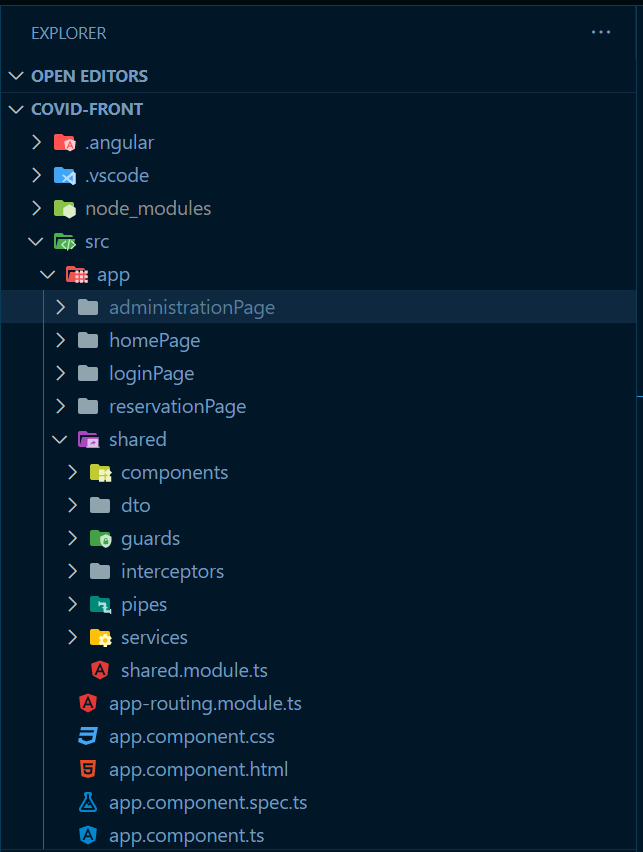

# Projet application web : Site de réservation vaccination Covid

Projet 5A SIR fait par : 

**MANUEL David 32025732**

**REECHT Florian  32025521**

------

[TOC]

------

## Introduction

**But : ** Le but du projet est de prendre en main les concepts de programmation full stack et de mise en production en développant et déployant une application web permettant aux utilisateurs de prendre un rendez-vous pour une vaccination Covid et  aux administrateurs et médecins de gérer les réservations ainsi que autres utilisateurs du site.

**Technologies utilisées : **

- BDD : 
  - PostgreSQL

- Back :
  - Java (version 17)
  - SpringBoot (2.7.4)
  - Gradle
- Front : 
  - Angular

## I. Structure de l'application

L'application est structuré en 3 parties : **La base de données**, **L'API Back** et **Le Front**

### Base de données

Voici la structure de la base de données : 

 La base de données a été en partie générée en partie par Liquibase et par Hibernate.

### API

Voici la structure de l'API : 

- **config :** Contient l'ensemble des classes de configuration Gérant notamment la sécurité, le rate-limit, les entityTags et les metriques.
- **controller :** Contient les RestController pour les endpoints admin et publics.
- **entity :** Contient les DTO correspondant aux tables de la base de données.
- **metrics :** Contient les aspects pour pour les métriques personnalisées.
- **Repository :** Contient les interfaces pour les requêtes à la base de données via JPARepository.
- **Service :** Contient les différents services disponibles pour les contrôleurs.
- **resources :** Contient les fichiers d'import, changelog de liquibase, filtres des URLs.
- **test :** Contient des tests unitaires.

### Front-end

Voici la structure du front :

- **administrationPage :** Ensemble des composants qui concerne la page d'administration du site (Back-office).
- **homePage :** Ensemble des composants concernant la page d'accueil.
- **loginPage :** Ensemble des composants concernant la page de connexion.
- **reservationPage :** Ensemble des composants concernant la page de prise de RDV pour la vaccination Covid.
  
## II. Modalités de déploiement

## III. Notes & Commentaires